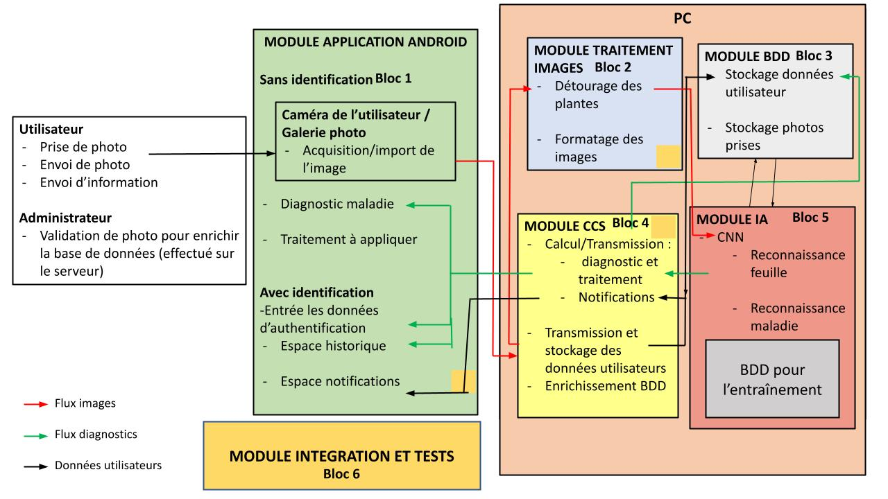

=== Description des interfaces (PAN1 / PAN2)
////
Pour le PAN1, il faut ident/Users/paulineescavi/Documents/1A/PACT/gitpact/rapport/architecture/Interfaces/interfaces.adocifier et décrire sommairement toutes les
interfaces entre modules.

Pour le PAN2, il faut une description complète des interfaces.

Il faut ici une description textuelle de chaque interface, c'est-à-dire chaque
échange entre deux blocs.
Si c’est une interface entre deux blocs informatiques, c’est une interface
Java.
S’il y a des échanges de données complexes, il faut en décrire le format avec
précision.
Si c’est une interface entre deux blocs électroniques, c’est une description
des signaux électroniques ou protocoles utilisés.
////

==== InterfaceBloc 1 - 4

Interface de 1 vers 4:

-Transmission de la photo du smartphone à la base de donnée pour son traitement et son ajout dans l'historique de l'utilisateur
-Transmission des données de l'utilisateur (identifiants, mot de passe)

Interface de 4 vers 1:

-Transmission des informations sur: le type de plante qui a été détectée, les maladies possibles, les soins possibles à apporter (articles de journaux, produits à appliquer, contacts de spécialiste)
-Transmission des informations à afficher dans les notifications de l'application. 
-Transmission de l'état de connexion du compte utilisateur (identifiant et mot de passe valide donc le compte s'ouvre)

==== InterfaceBloc 2 - 4

Interface de 4 vers 2:

-Transmission de la photo réceptionnée à la partie qui gère le détourage des plantes et le formatage des images pour qu'elles soient conformes au type de photos de la base de donnée. 

==== InterfaceBloc 4 - 3

Interface de 4 vers 3:

-Transmission de la photo et des diagnostics sur les maladies, et le type de plante pour l'ajouter à la base de donnée des plantes malades.
-Transmission de la photo et des diagnostics sur les maladies, et le type de plante pour l'ajouter à la base de donnée de l'historique de l'utilisateur. 
-Transmission des données de l'utilisateur (identifiants, mot de passe) pour la stocker dans une base de données des comptes utilisateurs.

Interface de 3 vers 4:

-Transmission des données d'un utilisateurs: historique, identifiants et mot de passe (qui restent invisibles pour l'utilisateur (au cas où ce n'est pas le détenteur du compte) mais qui permettent de comparer avec ce que l'utilisateur aura rentrer pour s'authentifier).
-Transmission des notifications (rappels etc)

==== InterfaceBloc 2 - 5

Interface de 2 vers 5:

-Envoie de la photo traitée à la partie IA pour une reconnaissance de la plante et des maladies possibles

==== InterfaceBloc 3 - 5

Le réseau de neurones s'appuie sur la base de donnée constamment enrichie pour reconnaître plante et maladies.

==== InterfaceBloc 4 - 5

Interface de 5 vers 4:

-Transmission des informations sur la plante reconnue, et sur les maladies possibles avec leur pourcentage de sureté. 

==== InterfaceBloc 6 - 1 à 5

-Les codes développés dans les blocs 1 à 5 devront s'intégrés les uns les autres. 

