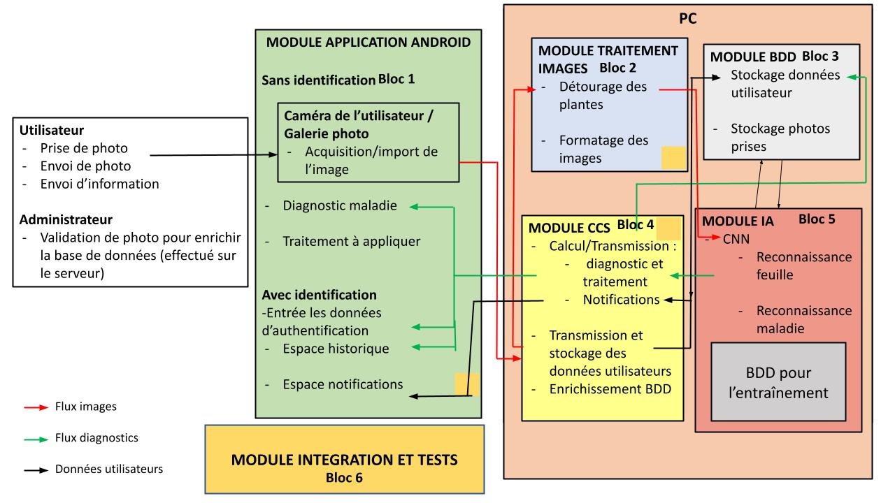

=== Schéma d’architecture
////
Insérer ici un ou plusieurs schémas d’architecture du projet. Voir le
cours d’introduction au Génie Logiciel. N’hésitez pas à faire des
schémas hiérarchiques, c'est-à-dire avec un bloc d’un schéma général
raffiné dans un second schéma ; ou des schémas en plusieurs parties.
////

==== Description des blocs

Il faut ici une description textuelle de chaque bloc, sa fonction
détaillée. En général, un bloc correspond à un module, sauf exception.
Il peut être adapté de faire des blocs plus petits qu’un module.

Il est important ici de distinguer les bibliothèques identifiées et
disponibles de ce que vous allez produire (coder) vous-même. Vous ne
devez pas réinventer la roue, mais vous ne devez pas non plus avoir votre
projet tout fait en encapsulant un programme déjà existant.

===== Bloc 1: Application Android

Ce bloc correspond à l'application Android.
-On distinguera deux versions d'utilisation de l'application, la version pro et la version amateur.
-Ensuite il y a la possibilité de s'identifier à l'aide d'un compte et d'en créer un si ce n'est pas déjà fait.
-Identifier ou non, l'utilisateur pourra commencer un diagnostic en prenant une photo d'un feuille de plante qu'il soupçonne malade. L'application affichera ensuite les maladies détectées (avec des pourcentage de probabilité), le type de plante et des solutions de soins. 
-Si l'utilisateur

===== NomBloc2

Description textuelle du bloc 1.
