=== Interface utilisateur graphique

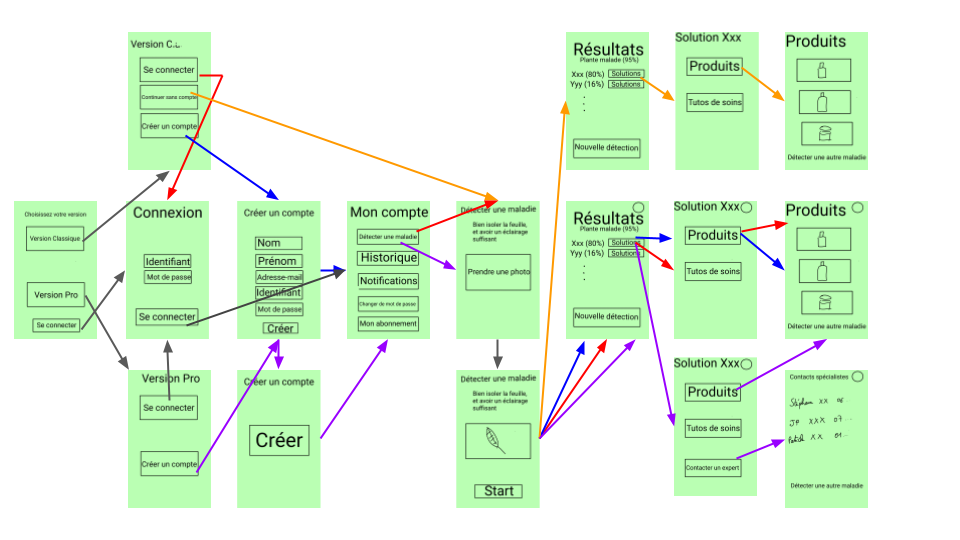

==== Page 1

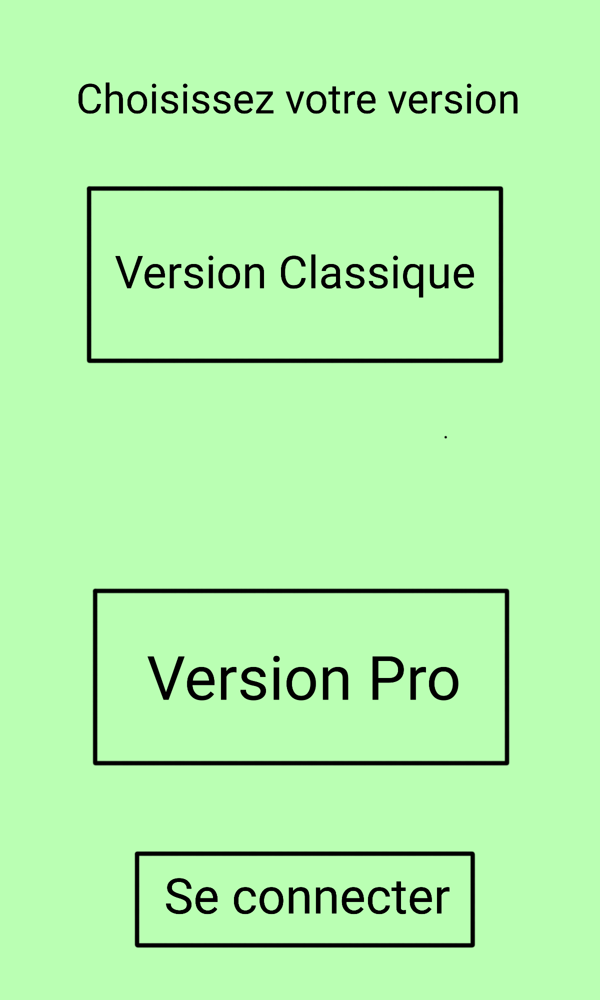

Cette page est la page d'accueil de l'application quand on la lance. Elle permet de choisir la version de l'application que l'on veut utiliser, la version Classique (pour les amateurs de botanique) ou la version Pro qui est payante est plus adaptée aux agriculteurs.
Un troisième bouton permet de se connecter directement.

Si on appuie sur le bouton "Version Pro" on est redirigé vers la page 2a.
Si on appuie sur le bouton "Version Classique" on est redirigé vers la page 2b.
Si on appuie sur le bouton "Se connecter" on est redirigé vers la page 5.

==== Page 2a
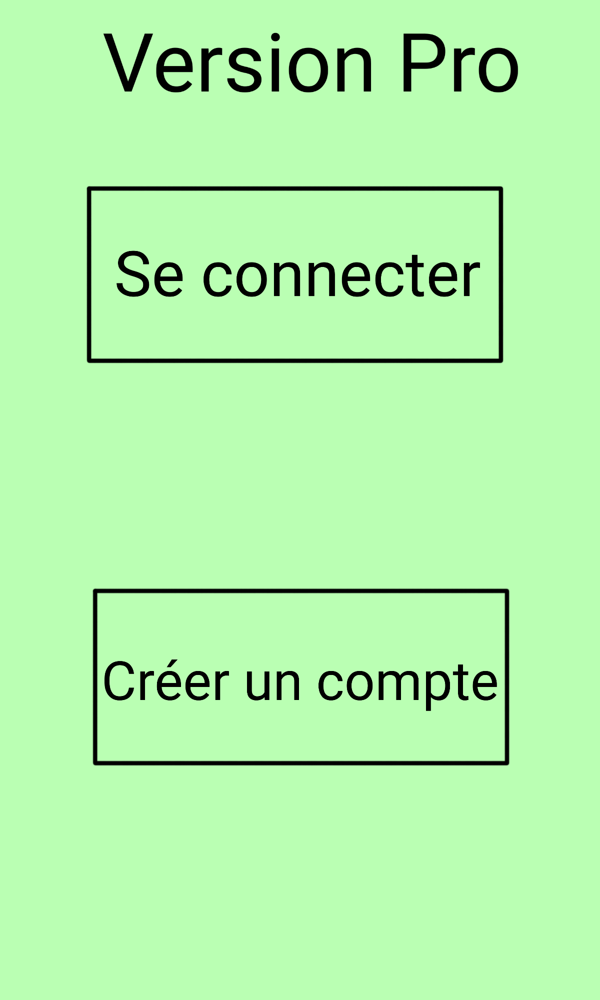

Cette page oblige l'utilisateur a posséder un compte car il doit payer un abonnement (c'est plus facile de gérer l'abonnement avec un compte). IL peut donc sur cette page, créer un compte s'il n'en a pas déjà un, ou alors il peut se connecter avec son compte déjà existant.

Si on appuie sur le bouton "Se connecter" on est redirigé vers la page 5.
Si on appuie sur le bouton "Créer un compte" on est redirigé vers la page 3b.

==== Page 2b
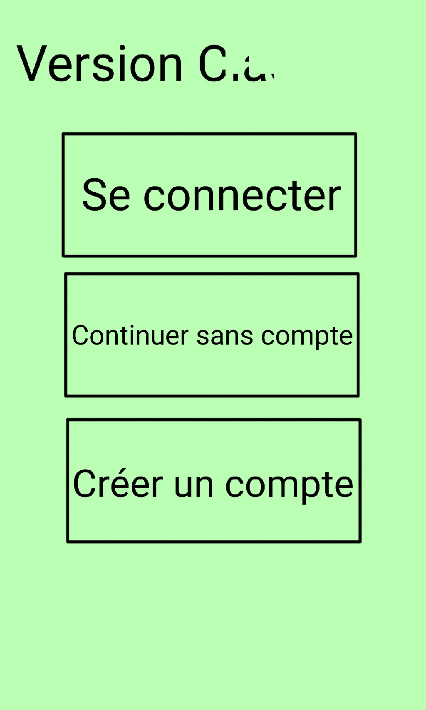
Cette page autorise l'utilisateur à se connecter avec ou sans compte. 

Si on appuie sur le bouton "Se connecter" on est redirigé vers la page 5.
Si on appuie sur le bouton "Créer un compte" on est redirigé vers la page 3a.
Si on appuie sur le bouton "Continuer sans compte" on est redirigé vers la page 7.

==== Page 3a
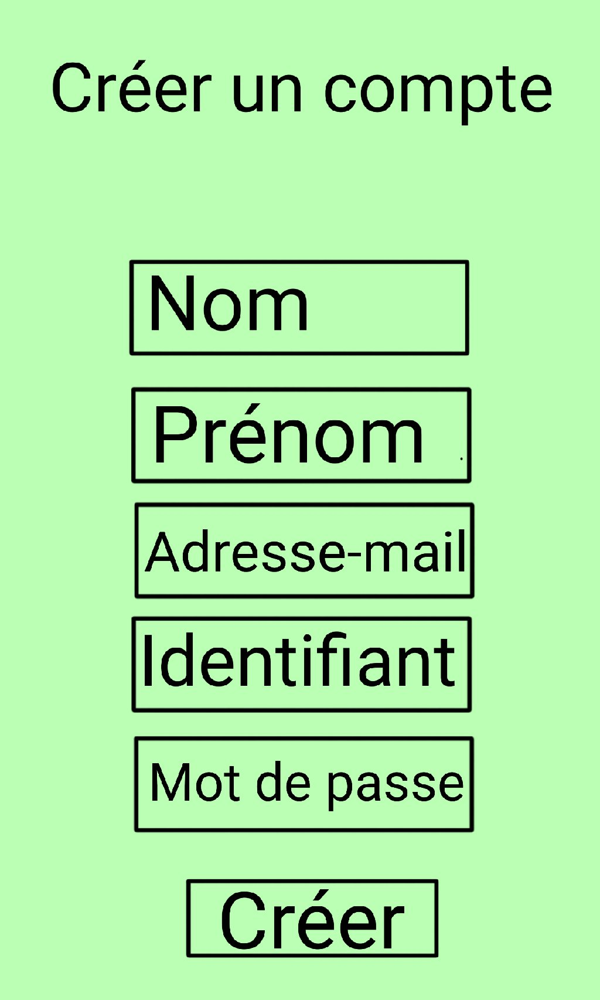
Cette page permet de créer un compte classique en rentrant Nom, Prénom, Adresse-mail, Identifiant, Mot de passe.

Si on appuie sur le bouton "Créer" on est redirigé vers la page 6.

==== Page 3b

Cette page permet de créer un compte pro en rentrant Nom, Prénom, Adresse-mail, Identifiant, Mot de passe. Un fois toute ces informations rentrées, il faut cliquer sur payer, et cela redirige vers une page de paiement.

Une fois le paiement terminé, l'utilisateur est automatiquement redirigé vers l'application sur la page 4.

==== Page 4
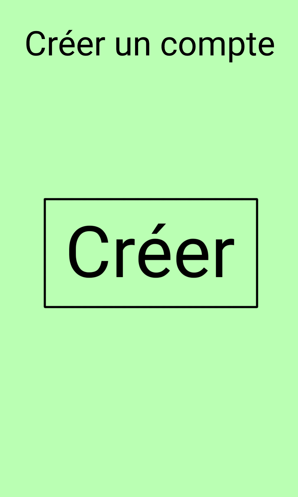
Cette page vient finaliser la création du compte pro. 

Si on appuie sur le bouton "Créer" on est redirigé vers la page 6.

==== Page 5
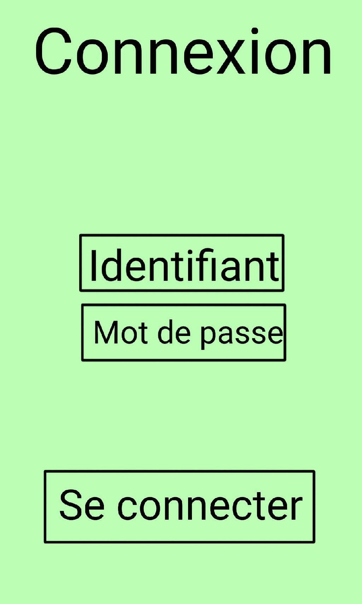
Cette page permet de se connecter à son compte (peu importe le type de compte), en entrant identifiant et mot de passe. 

Si on appuie sur le bouton "Se connecter" on est redirigé vers la page 6.

==== Page 6image::../images/IHM/page6.png[Page 6, 300,500]
Cette page correspond au tableau de bord d'un utilisateur ayant un compte. Il peut soit faire une détection de maladie, soit changer de mot de passe, consulter son historique, ses rappels (notifications) et consulter l'état de son abonnement.

Si on appuie sur le bouton "Détecter une maladie" on est redirigé vers la page 7. 

==== Page 7
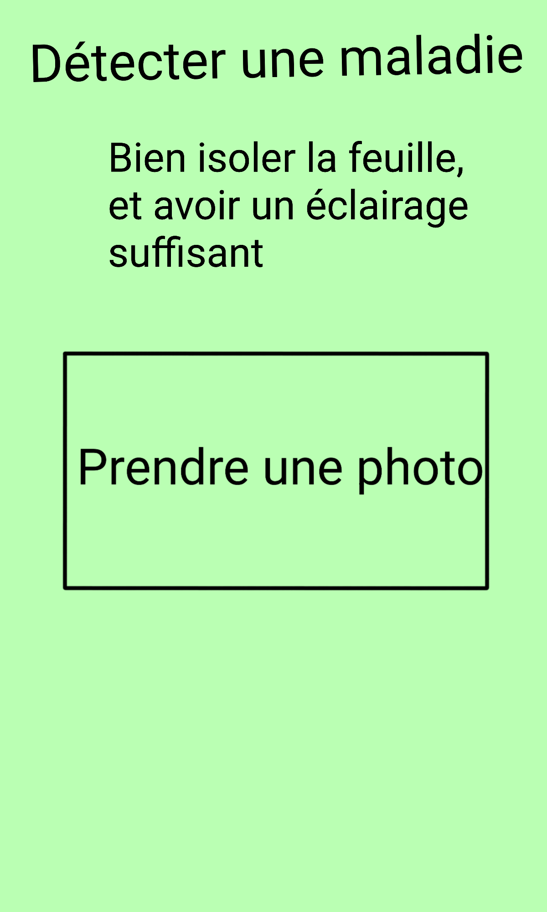
Cette page permet de prendre une photo d'une feuille que l'on soupçonne malade. En appuyant sur le bouton "prendre une photo", l'appareil photo du téléphone se met en marche et une fois la photo prise, elle est importée dans l'application. 
Une fois la photo importée, l'utilisateur est redirigé sur la page 8.

==== Page 8
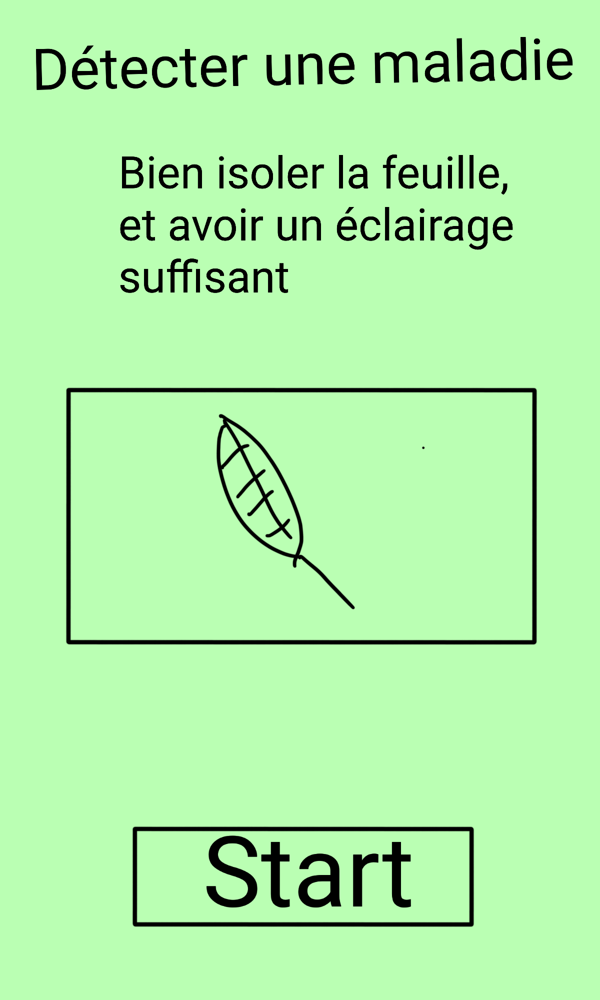
Cette page permet de visualiser la photo prise et de confirmer qu'on veut lancer la détection.

Si on appuie sur le bouton "Start" on est redirigé vers la page 9a ou 9b en fonction de si l'utilisateur est connecté.
S'il est connecté, il va sur la page 9a, sinon sur la 9b.

==== Page 9a
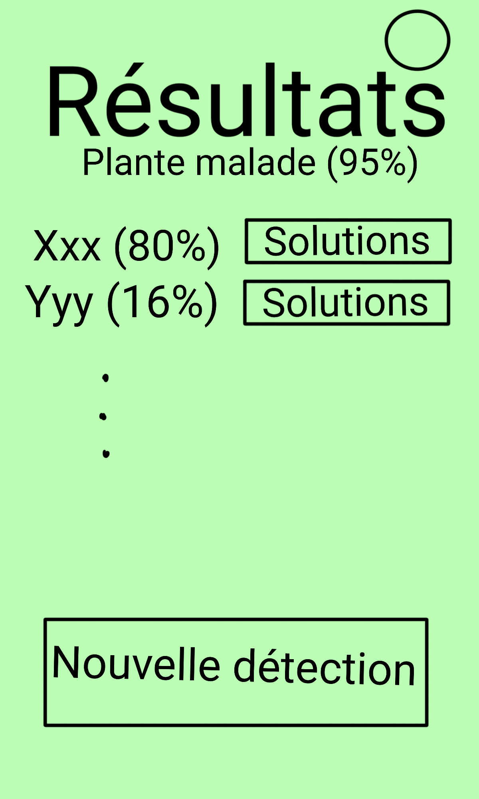

Cette page contient tous les pourcentages de sureté des maladies. La plante est malade à 95% et la maladie Xxx dévaste la plante avec une probabilité de 80%.
Pour chaque maladie, des solutions de soins sont proposées en cliquant sur le bouton correspondant à la maladie que l'on souhaite soigner. 
On peut également réaliser une nouvelle détection de maladie. 
Le bouton rond en haut à droite signifie que l'utilisateur est connecté à son compte et en appuyant sur ce bouton l'utilisateur est redirigé vers le tableau de bord de son compte.

Si on appuie sur le bouton rond on est redirigé vers la page 6.
Si on appuie sur le bouton "Solutions" (en face de la maladie Xxx) on est redirigé vers la page 10b si on a un compte Pro et vers la page 10c si on a un compte Classique.
Si on appuie sur le bouton "Nouvelle Détection" on est redirigé vers la page 7.

==== Page 9b

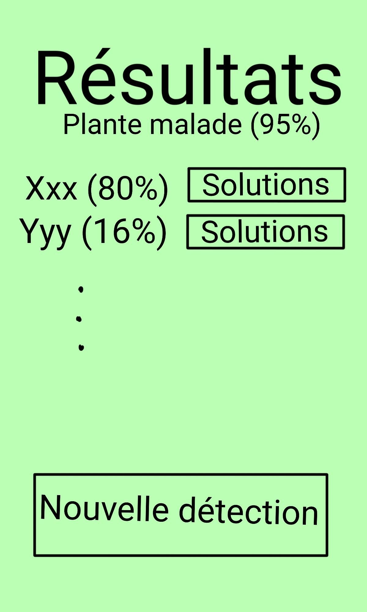

C'est la même page que la précédente mais il n'y a ici pas de bouton rond car cette page est faite pour l'utilisateur non connecté à un compte.

Si on appuie sur le bouton "Solutions" (en face de la maladie Xxx) on est redirigé vers la page 10a.
Si on appuie sur le bouton "Nouvelle Détection" on est redirigé vers la page 7.

==== Page 10a

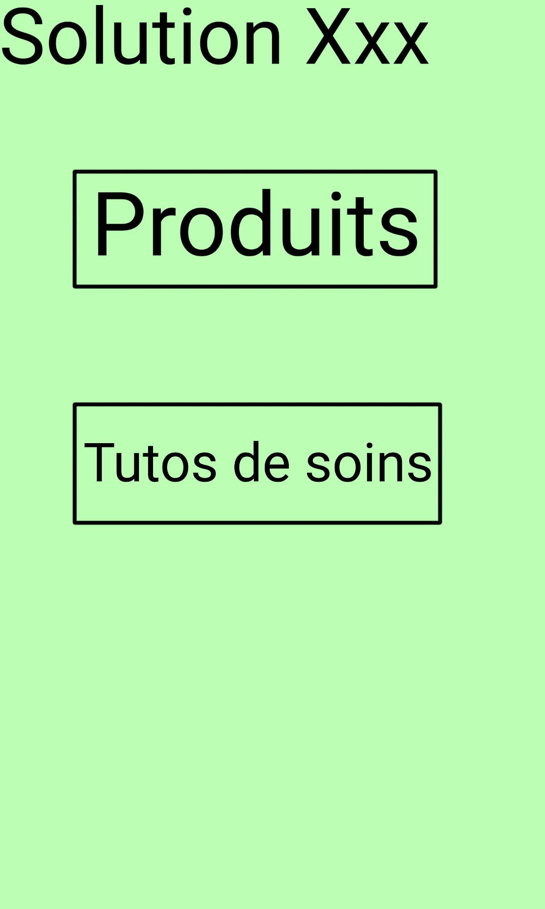

Cette page comporte deux types de solutions pour combattre la maladie Xxx. L'utilisateur peut consulter et acheter des produits pour soigner ses plantes mais il peut aussi consulter un tuto (pas des tutos, erreur sur le texte de l'image).

Si on appuie sur le bouton "Produits" on est redirigé vers la page 11b.
Si on appuie sur le bouton "Tuto de soins" on est redirigé vers un tuto internet (vidéo ou écrit).

==== Page 10b

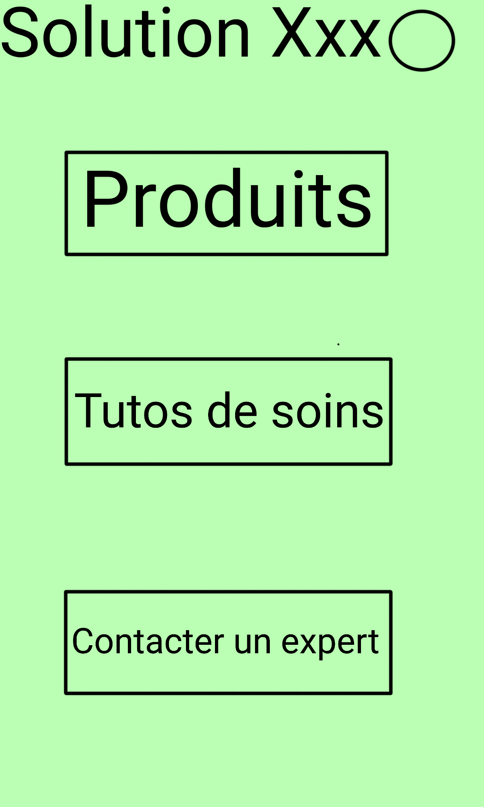

Cette page comporte les mêmes solutions que la page précédente mais en plus il y a une option qui permet d'avoir les coordonnées téléphoniques de techniciens pour venir soigner la plante eux-mêmes. De plus il y a le rond à droite qui signifie que l'utilisateur est connecté.

Si on appuie sur le bouton "Produits" on est redirigé vers la page 11a.
Si on appuie sur le bouton "Tuto de soins" on est redirigé vers un tuto internet (vidéo ou écrit).
Si on appuie sur le bouton "Contacter un expert" on est redirigé vers la page 12.
Si on appuie sur le bouton rond on est redirigé vers la page 6.

==== Page 10c

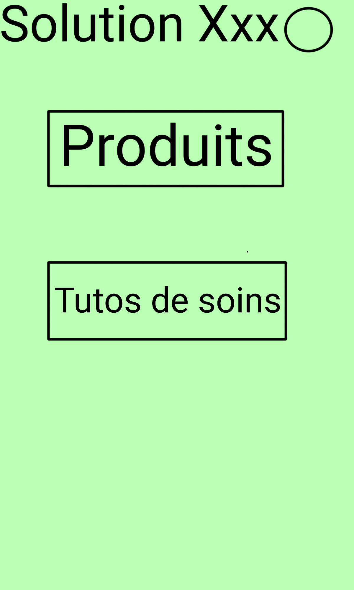

Cette page est similaire à la page 10a sauf qu'il y a en plus le cercle en haut à droite qui signifie que l'utilisateur est connecté.

Si on appuie sur le bouton "Produits" on est redirigé vers la page 11a.
Si on appuie sur le bouton "Tuto de soins" on est redirigé vers un tuto internet (vidéo ou écrit).
Si on appuie sur le bouton rond on est redirigé vers la page 6.

==== Page 11a

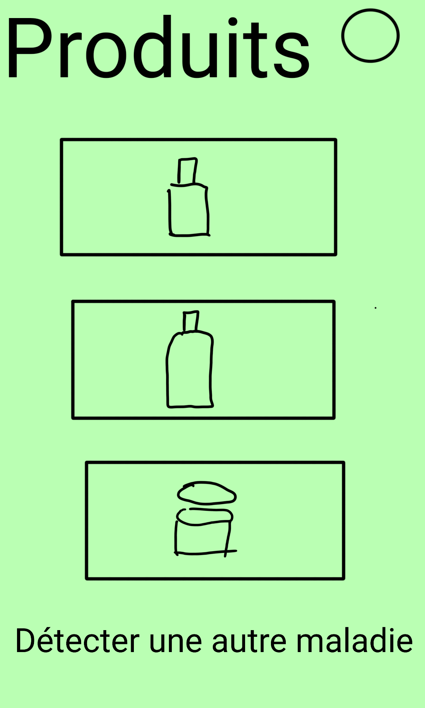

Cette page comporte des produits à acheter pour soigner sa plante. Chaque image de produit est associée à un lien de parrainage qui permet d'acheter le produit mais qui nous permet aussi de gagner des commissions. En cliquant sur une photo on est redirigé vers le produit que l'on peut acheter sur un site tiers (Amazon, ...). Le bouton Détecter une autre maladie peut être utilisé pour détecter une autre maladie. L'utilisateur est ici connecté car il y a le cercle.

Si on appuie sur le bouton "Détecter une autre maladie" on est redirigé vers la page 7.
Si on appuie sur une image on est redirigé vers le produit sur Amazon par exemple.
Si on appuie sur le bouton rond on est redirigé vers la page 6.

==== Page 11b

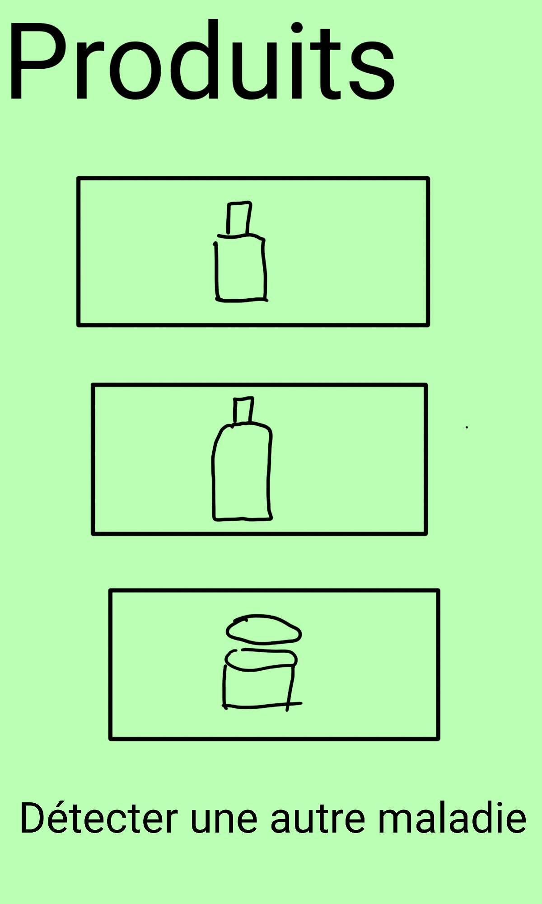

C'est la même page que la précédente mais ici il n'y a pas le cercle de connexion.

Si on appuie sur le bouton "Détecter une autre maladie" on est redirigé vers la page 7.
Si on appuie sur une image on est redirigé vers le produit sur Amazon par exemple.

==== Page 12

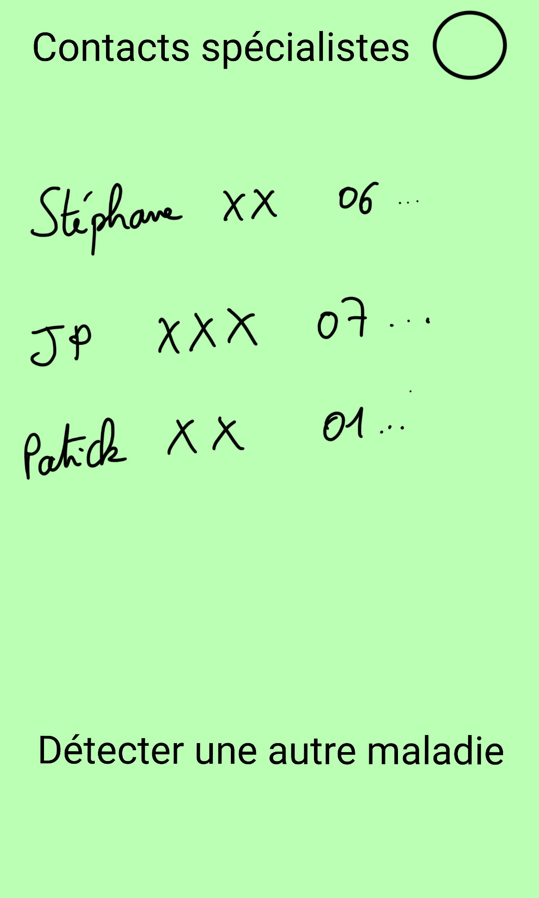

Cette page comporte des contacts téléphoniques de spécialistes, techniciens à contacter si on veut soigner ses plantes. On peut aussi détecter une autre maladie. Cette page est uniquement accessible au compte Pro (ceux qui payent un abonnement). 

Si on appuie sur le bouton "Détecter une autre maladie" on est redirigé vers la page 7.
Si on appuie sur le bouton rond on est redirigé vers la page 6.

NB: Certaines pages ne sont pas tout à fait correctes (page 7 par ex, il manque la version où l'utilisateur est connecté, et quelques autres oublis dont je me suis rendue compte trop tard... l'idée générale est là cependant.)

