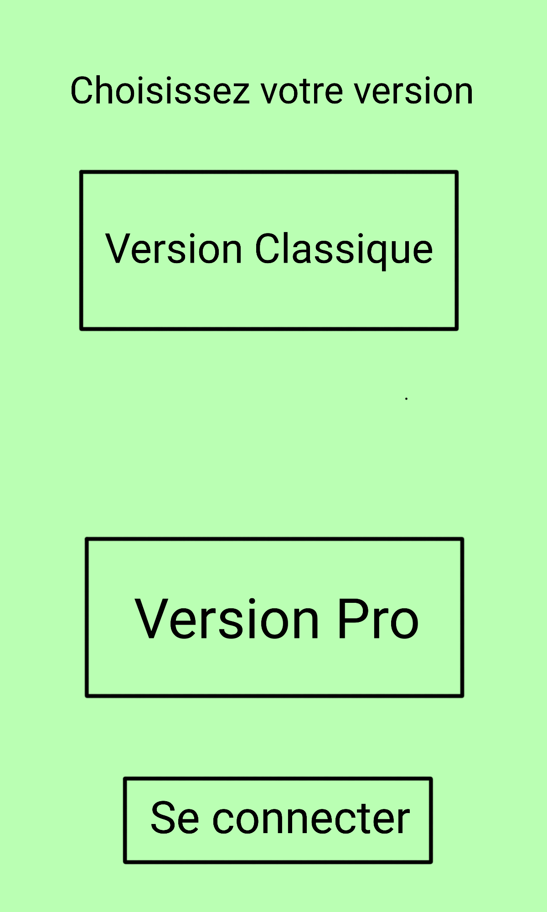
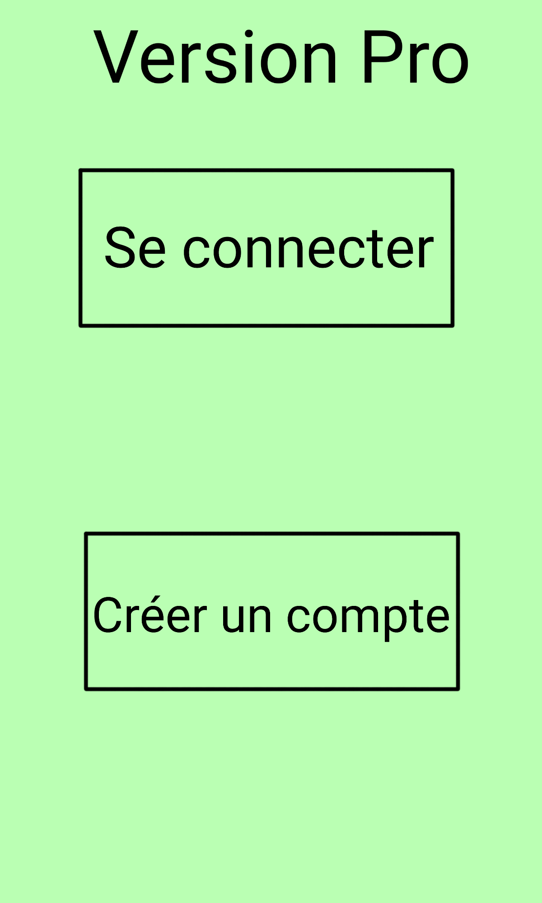
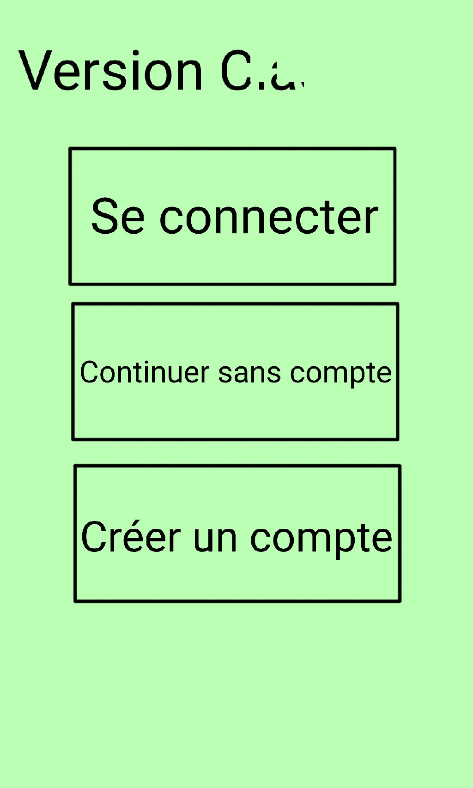
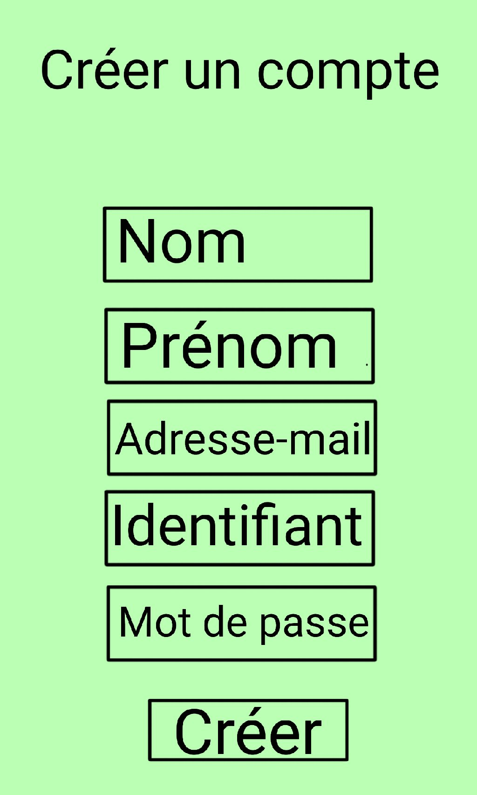
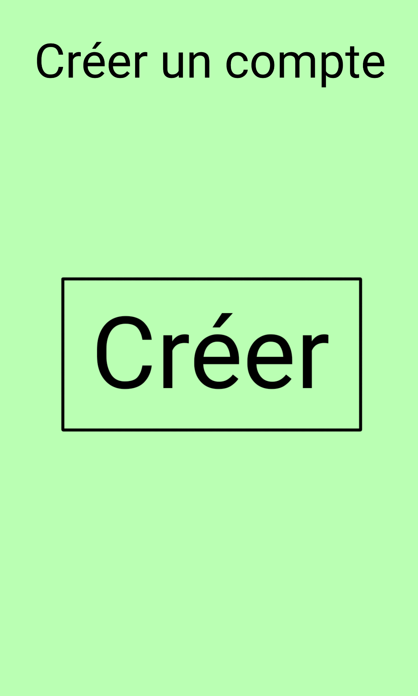
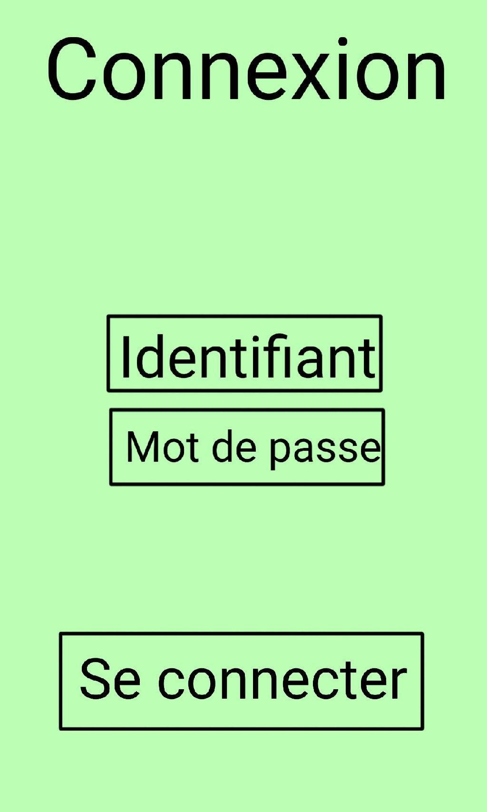
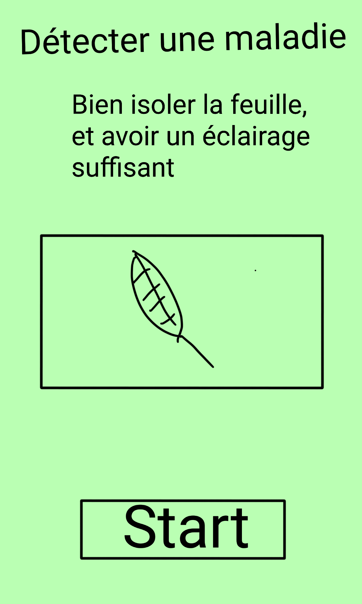
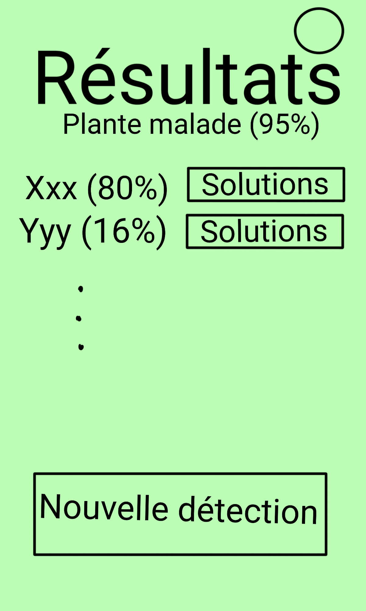

=== Interface utilisateur graphique

==== Page 1

Cette page est la page d'accueil de l'application quand on la lance. Elle permet de choisir la version de l'application que l'on veut utiliser, la version Classique (pour les amateurs de botanique) ou la version Pro qui est payante est plus adaptée aux agriculteurs.
Un troisième bouton permet de se connecter directement.

Si on appuie sur le bouton "Version Pro" on est redirigé vers la page 2a.
Si on appuie sur le bouton "Version Classique" on est redirigé vers la page 2b.
Si on appuie sur le bouton "Se connecter" on est redirigé vers la page 5.

==== Page 2a

Cette page oblige l'utilisateur a posséder un compte car il doit payer un abonnement (c'est plus facile de gérer l'abonnement avec un compte). IL peut donc sur cette page, créer un compte s'il n'en a pas déjà un, ou alors il peut se connecter avec son compte déjà existant.

Si on appuie sur le bouton "Se connecter" on est redirigé vers la page 5.
Si on appuie sur le bouton "Créer un compte" on est redirigé vers la page 3b.

==== Page 2b

Cette page autorise l'utilisateur à se connecter avec ou sans compte. 

Si on appuie sur le bouton "Se connecter" on est redirigé vers la page 5.
Si on appuie sur le bouton "Créer un compte" on est redirigé vers la page 3a.
Si on appuie sur le bouton "Continuer sans compte" on est redirigé vers la page 7.

==== Page 3a

Cette page permet de créer un compte classique en rentrant Nom, Prénom, Adresse-mail, Identifiant, Mot de passe.

Si on appuie sur le bouton "Créer" on est redirigé vers la page 6.

==== Page 3b

Cette page permet de créer un compte pro en rentrant Nom, Prénom, Adresse-mail, Identifiant, Mot de passe. Un fois toute ces informations rentrées, il faut cliquer sur payer, et cela redirige vers une page de paiement.

Une fois le paiement terminé, l'utilisateur est automatiquement redirigé vers l'application sur la page 4.

==== Page 4

Cette page vient finaliser la création du compte pro. 

Si on appuie sur le bouton "Créer" on est redirigé vers la page 6.

==== Page 5

Cette page permet de se connecter à son compte (peu importe le type de compte), en entrant identifiant et mot de passe. 

Si on appuie sur le bouton "Se connecter" on est redirigé vers la page 6.

==== Page 6image::../architecture/IHM/page6.png[Page 6, 300,500]
Cette page correspond au tableau de bord d'un utilisateur ayant un compte. Il peut soit faire une détection de maladie, soit changer de mot de passe, consulter son historique, ses rappels (notifications) et consulter l'état de son abonnement.

Si on appuie sur le bouton "Détecter une maladie" on est redirigé vers la page 7. 

==== Page 7
image::../architecture/IHM/page7.png[Page 7, 300,500]
Cette page permet de prendre une photo d'une feuille que l'on soupçonne malade. En appuyant sur le bouton "prendre une photo", l'appareil photo du téléphone se met en marche et une fois la photo prise, elle est importée dans l'application. 
Une fois la photo importée, l'utilisateur est redirigé sur la page 8.

==== Page 8

Cette page permet de visualiser la photo prise et de confirmer qu'on veut lancer la détection.

Si on appuie sur le bouton "Start" on est redirigé vers la page 9a ou 9b en fonction de si l'utilisateur est connecté.
S'il est connecté, il va sur la page 9a, sinon sur la 9b.

==== Page 9a

